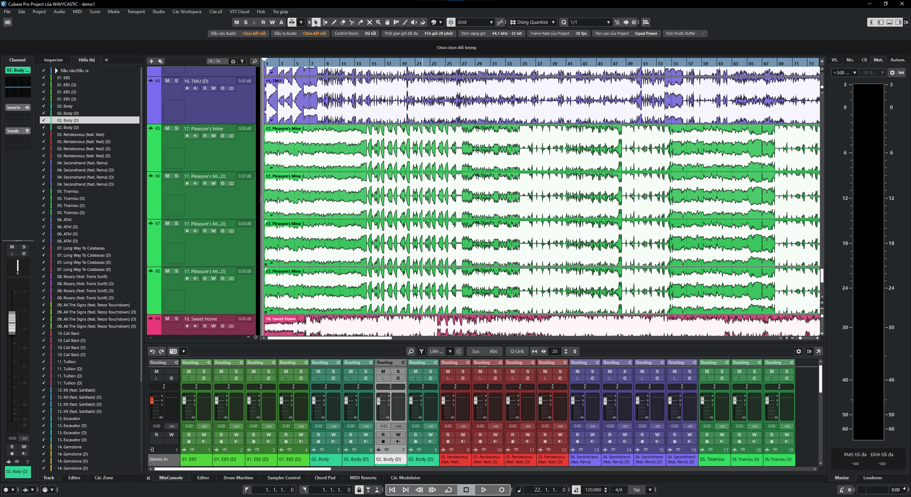

# cubase-vi — Vietnamese UI for Cubase 15

**Tiếng Việt: xem [README.vi.md](README.vi.md).**



## Why use this?

Cubase is hard to pick up, and picking it up in English is harder. Menus
like `Direct Offline Processing` or `Retrospective Record` turn beginners
away before they make a sound.

This translation fixes that specific problem:

- Buttons, dialogs, warnings: Vietnamese.
- Trade terms: English (`Cycle`, `Quantize`, `Side-Chain`), so YouTube
  tutorials still match the screen word for word.
- All 10,737 strings, Score Editor included. No part of the app drops
  back to English mid-session.
- One XML file Cubase reads on its own. Uninstall puts everything back.

Cubase ships no Vietnamese localization. Its UI strings are not compiled
or encrypted. They sit in a plain-text XML resource (`TRANSLATION.XML`),
and Cubase reads `translation.xml` from disk before using the copy inside
`Cubase15.exe`. This repo exploits that order: drop in a file, done.
No patching.

The translation is mixed on purpose. Ordinary words are Vietnamese, trade
terms stay English so tutorials stay searchable
(`Bật Cycle`, `Chế độ Absolute`, `Triads`). The rules behind each choice
are written down in [`AGENT.md`](AGENT.md) and checked by machine.

| | |
|---|---|
| Strings | 10,737 |
| Source languages | 9 (`us de fr es it pt jp zh ru`) |
| Translated | **10,737 (100%)** |
| Tests | full suite passing |

## Quick start

```powershell
# translate: edit a batch, then merge -> check -> build -> test
notepad translations\batches\round_NNN.json
python tools\merge_maps.py
python tools\build.py style
python tools\build.py punct
python tools\tests\run.py

# deploy (backs up the old files automatically)
powershell -ExecutionPolicy Bypass -File scripts\install.ps1 -Variant full

# in Cubase: Edit > Preferences > General > Language > Vietnamese > restart
```

## Layout

```
translations/vi.json            the merged map — the single source of truth
translations/batches/*.json     one fix batch per round (next free number)
keys/all_strings.tsv            10,737 keys with English source (reference)
tools/read.py                   read the map: page / long / short / inspect
tools/merge_maps.py             merge batches into vi.json (--check for CI)
tools/build.py                  style + punct checks, XML build
tools/audit.py                  20+ defect detectors
tools/dupes.py                  duplicate values, plural drift
tools/family.py                 one term across all its siblings
tools/group_by_offset.py        group strings by .rdata offset (63% covered)
tools/clarity.py                long + hard-to-read strings
tools/review_all.xlsx           all strings, EN/DE/FR/VI side by side
tools/tests/run.py              full test suite — no Cubase needed
scripts/install.ps1             install / uninstall (-Variant full)
docs/RESEARCH.md                how the loader mechanism was found
docs/OPEN_QUESTIONS.md          frozen terminology decisions
COMMIT_CONVENTION.md            commit messages: English-only, round format
AGENT.md                        mandatory rules for translation work
```

## Adding a fix

1. Find the defect: read in order (`python tools\read.py page 1 100`),
   or inspect a suspect (`python tools\read.py inspect <key>`).
2. Settle terminology against all 9 source languages, then the term's
   family (`family.py`), then the map majority — never one sibling alone.
3. Write `translations/batches/round_NNN.json` (next free number),
   run the pipeline above. Style, punct, and the full test suite must pass.
4. Commit per [`COMMIT_CONVENTION.md`](COMMIT_CONVENTION.md), push.

Quoted names must match the label they quote (`audit.py quotes`);
a quoted `'Stop'` reads `'Dừng'` because the `Stop` label is `Dừng`.

## Requirements

- Python 3.10+, standard library only. No dependencies to install.
- Cubase 15 installed (the build reads your own copy).
- Close Cubase fully before deploying.

## Legal

This is a **UI supplement for your own machine**. It does not touch
Cubase licensing or copy protection.

`keys/all_strings.tsv` is **Steinberg's content** (extracted from
`Cubase15.exe`), committed deliberately as a reference table — see
[`NOTICE.md`](NOTICE.md). The 4.65 MB original XML with all 9 vendor
translations is **not** committed; `tools/build.py` rebuilds from the
Cubase on your machine.

If Steinberg ever ships official Vietnamese, use theirs.
